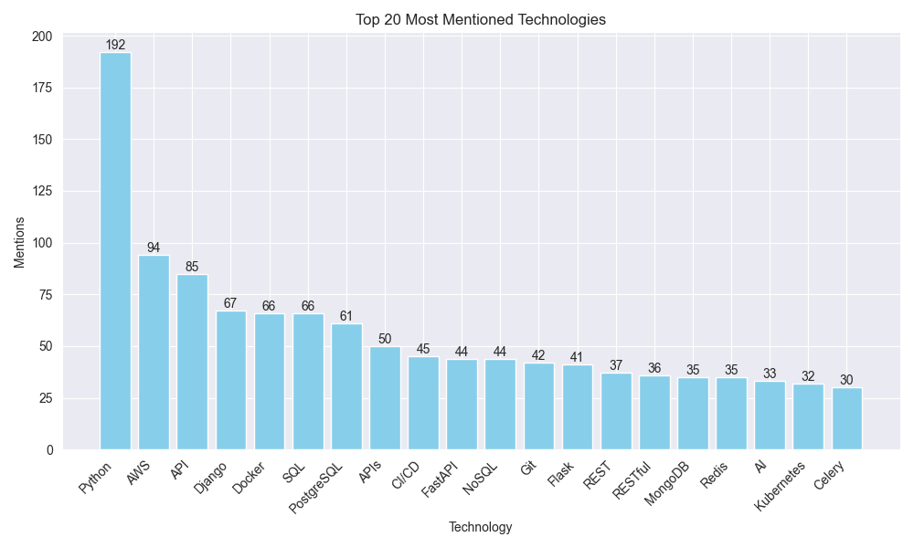

# Python Technologies Statistics

This project aims to analyze the most in-demand technologies in the IT market, based on job vacancies for Python developers.

## Installation

1. Clone the repository: 
    ```
    git clone https://github.com/your_username/python-technologies-statistics.git
    ```

2. Install the dependencies:
    ```
    pip install -r requirements.txt
    ```

## Usage
1. Run the parser: `python parse.py` (the data will be saved to `vacancies.csv`) !!! Note: The parser is obligatory to run before the `analysis_technologies.ipynb`, unless you have the jobs.csv file already.
2. Analyze and visualize the data: jupyter notebook `analysis_technologies.ipynb`. Click button `Run all` or `CTRL + ALT + SHIF + Enter`

## Additional Instructions
* To scrape data from other occupation, changed OCCUPATION in the ```config.py``` file.
* The results of the analysis and visualizations are stored in the `graphs-archive` folder for further analysis and comparison.

## Examples:


